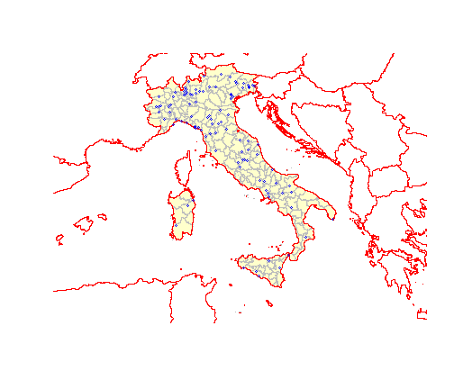

Mapping in R demonstration - Italy
========================================================

Download and read data files as spatial objects:


```r
# install.packages('spdep')
library(spdep)
library(rgdal)
setwd("F:/Students/YilanChen")
# download postal code centroids - subsitutes for address xy
download.file("http://download.geonames.org/export/zip/IT.zip", destfile = "geonames_postcodes_italy.zip")
unzip("geonames_postcodes_italy.zip")
postcodesItaly <- read.table("IT.txt", sep = "\t", header = F, quote = "")
names(postcodesItaly) <- c("countrycode", "postalcode", "placename", "admin1name", 
    "admin1code", "admin2name", "admin2code", "admin3name", "admin3code", "latitude", 
    "longitude", "accuracy")
write.table(postcodesItaly, file = "postocodeItaly.csv", sep = ",", row.names = F)
postcodesXY <- postcodesItaly[, c("latitude", "longitude")]
# download GIS data from Italian government site lots of GIS data - I will
# use 'tribunali' - some sorts of judicial boundaries?
# download.file('http://www3.istat.it/dati/catalogo/20090728_00/cartografia.zip',destfile='cartographia.zip')
# unzip('cartographia.zip') one problem - the data is projected
utm32nwgs84 <- CRS("+proj=utm +zone=32 +ellps=WGS84 +datum=WGS84 +units=m +no_defs")
tribunali <- readShapeSpatial("cartografia/tribunali", ID = "CodTrib", proj4string = utm32nwgs84)
# MANUALLY download more background kind of GIS data - world country
# boundaries (ad1) -
# http://www.fao.org/geonetwork/srv/en/resources.get?id=29034&fname=rwdb_ad1_py.zip&access=private
# followings are just optional: administrative boundaries (ad2), railroads
# & water - admin2:
# http://www.fao.org/geonetwork/srv/en/resources.get?id=29036&fname=rwdb_ad2_py.zip&access=private
# - rail:
# http://www.fao.org/geonetwork/srv/en/resources.get?id=29045&fname=rwdb_rr.zip&access=private
# - water:
# http://www.fao.org/geonetwork/srv/en/resources.get?id=29046&fname=rwdb_swb_py.zip&access=private
unzip("rwdb_ad1_py.zip")
wgs84 <- CRS("+proj=longlat +ellps=WGS84 +datum=WGS84")
countries <- readShapeSpatial("RWDB_Ad1-Py", ID = "PY_ID", proj4string = wgs84)
# reproject tribunali boundaries so that all are in lat/lon geographic
# coordinate
tribunali <- spTransform(tribunali, CRS = wgs84)
```


Plot/map data files:
- countries boundaries as the background - red lines
- Italian tribunali boundaries as our focus/extent - yellow fill
- add selected postcode centroids as blue points


```r
plot(tribunali, border = "grey", col = "#FFFFCC", xlim = c(bbox(tribunali)[1, 
    1], bbox(tribunali)[1, 2]), ylim = c(bbox(tribunali)[2, 1], bbox(tribunali)[2, 
    2]))
plot(countries, border = "red", pch = 20, add = T)
# plotting 17,980 post codes is too much - just plot sample of 100 obs.
set.seed = 678910
temp <- 1:17980
psample <- sample(temp, size = 100)
points(y = postcodesXY[psample, 1], x = postcodesXY[psample, 2], col = "blue", 
    cex = 0.5)
```

 


